# GoPress Code Graph

本文档是对当前目录下代码的结构化阅读笔记，描述 GoPress 的模块职责、依赖关系、运行流程和关键数据流。

## 1. 项目总览

GoPress 是一个用 Go 编写的 Markdown 静态站点生成器，提供两种主要模式：

- `gopress dev [root]`：启动开发服务器，按请求实时渲染 Markdown，并通过 WebSocket 支持 live reload。
- `gopress build [root]`：遍历站点目录，将 Markdown 构建为静态 HTML，并复制静态资源。

核心架构可以概括为：

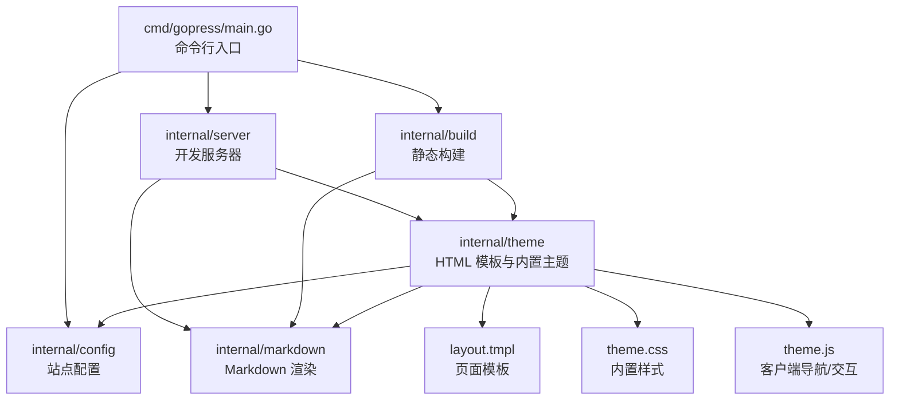

## 2. 顶层文件与目录

| 路径 | 职责 |
| --- | --- |
| `cmd/gopress/main.go` | CLI 入口，定义 `dev` 和 `build` 子命令。 |
| `internal/config/config.go` | 配置结构定义、默认配置、JSON/YAML 配置加载。 |
| `internal/markdown/markdown.go` | Markdown 到 HTML 的渲染，frontmatter 元数据读取，LRU 缓存。 |
| `internal/theme/theme.go` | 嵌入主题资源、解析首页/功能区/上下页数据、执行 HTML 模板。 |
| `internal/theme/layout.tmpl` | 页面 HTML 模板，包含导航、侧边栏、首页、正文、页脚。 |
| `internal/theme/theme.css` | 内置主题样式。 |
| `internal/theme/theme.js` | 客户端 SPA 式导航、暗色模式、移动侧边栏、侧边栏折叠状态持久化。 |
| `internal/server/server.go` | 开发服务器 HTTP 路由和动态 Markdown 渲染。 |
| `internal/server/livereload.go` | 文件监听与 WebSocket live reload。 |
| `internal/build/build.go` | 生产构建流程，输出 HTML、主题资源和静态资源。 |
| `docs/` | 示例站点内容与 `.gopress/config.json` 配置。 |
| `Dockerfile` | 多阶段构建 GoPress 镜像，默认运行 dev server。 |
| `docker-compose.yml` | 本地容器化开发配置，将 `./docs` 挂载到容器。 |
| `使用说明.txt` | 常用构建、运行命令备忘。 |

## 3. 包级依赖图

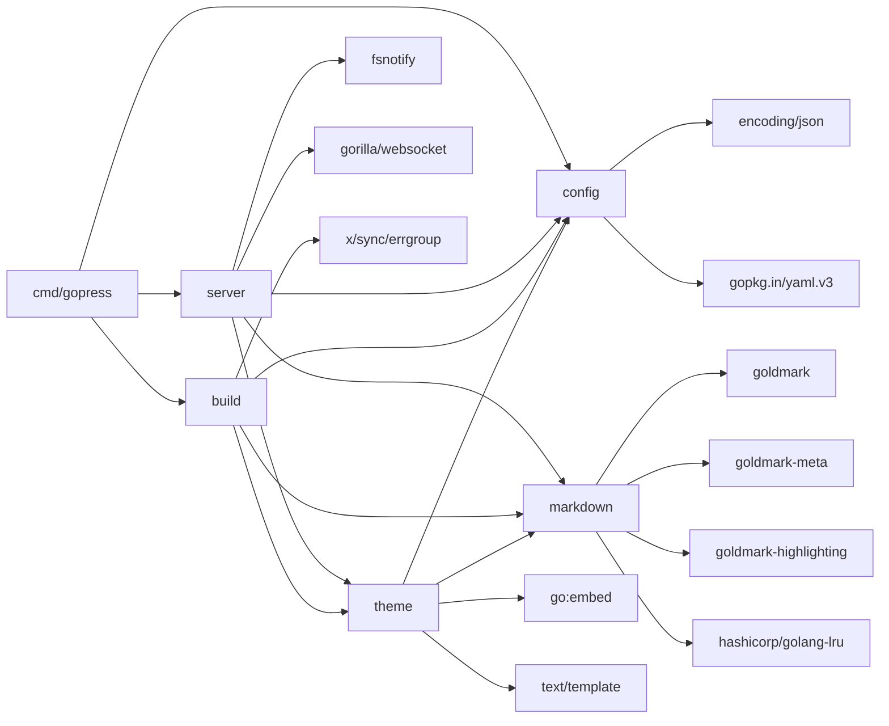

## 4. CLI 入口

文件：`cmd/gopress/main.go`

### 命令树

```text
gopress
├── dev [root]
│   └── --port, -p int  默认 5173
└── build [root]
    └── --outDir, -o string  默认 root/.gopress/dist
```

### `dev` 命令流程

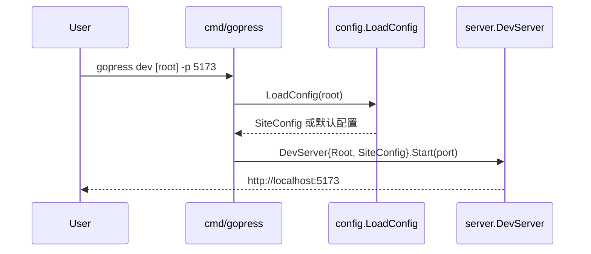

### `build` 命令流程

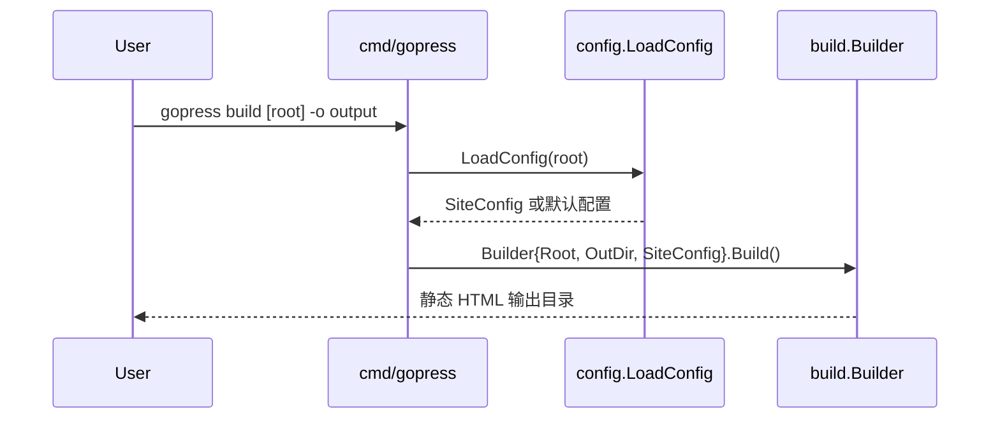

## 5. 配置模块

文件：`internal/config/config.go`

### 数据模型

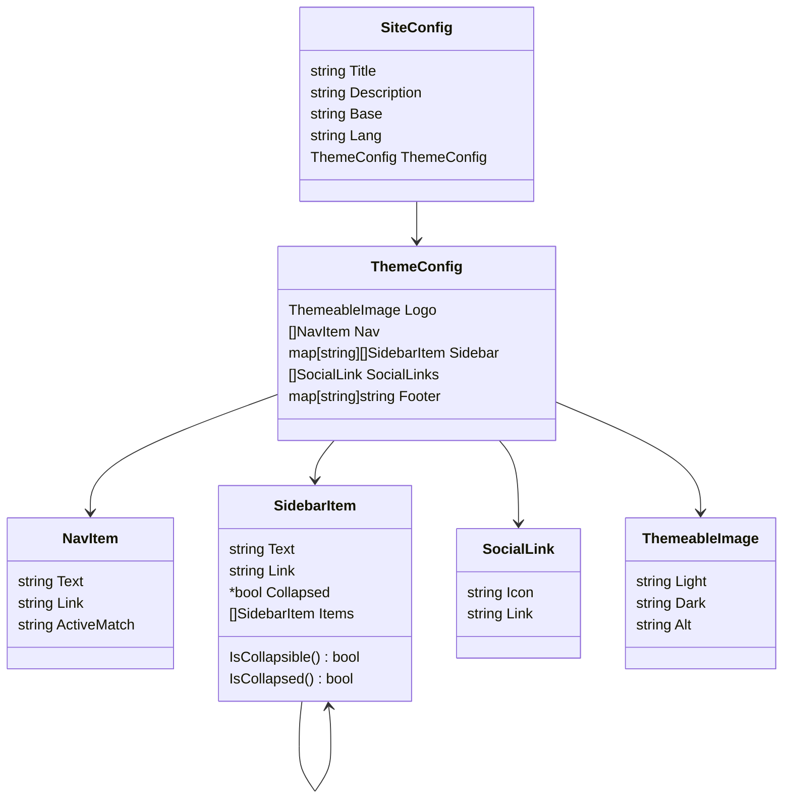

### 配置加载顺序

`LoadConfig(root)` 的查找顺序：

1. `root/.gopress/config.json`
2. `root/.gopress/config.yaml`
3. 如果都不存在，返回 `DefaultSiteConfig()`

当前示例配置位于 `docs/.gopress/config.json`，包含：

- 站点标题 `My GoPress WebSite`
- 明暗主题 logo
- 顶部导航：Home、Guide、IceTest
- 全站侧边栏配置
- footer 信息
- GitHub social link

## 6. Markdown 渲染模块

文件：`internal/markdown/markdown.go`

### 核心类型

```go
type RenderResult struct {
    HTML  string
    Meta  map[string]interface{}
    Title string
}
```

### 渲染流程

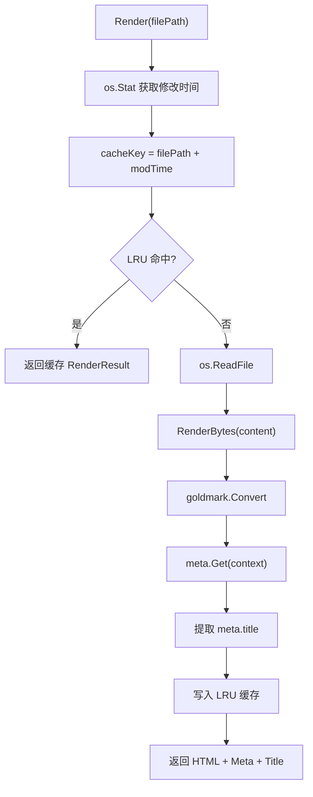

### Goldmark 能力

`RenderBytes` 启用：

- `extension.GFM`
- `goldmark-meta` frontmatter
- `goldmark-highlighting`，样式为 `github`
- 自动 heading ID
- hard wraps
- unsafe HTML

## 7. 主题模块

文件：

- `internal/theme/theme.go`
- `internal/theme/layout.tmpl`
- `internal/theme/theme.css`
- `internal/theme/theme.js`

### 嵌入资源

`theme.go` 使用 `go:embed` 将主题文件编译进二进制：

```go
//go:embed theme.css
var themeCSS string

//go:embed theme.js
var themeJS string

//go:embed layout.tmpl
var layoutHTML string
```

### 页面数据模型

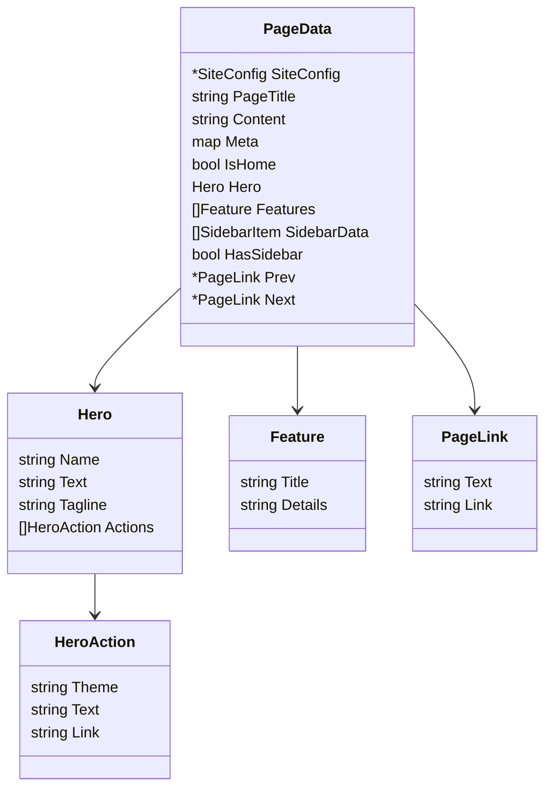

### `GenerateHTML` 流程

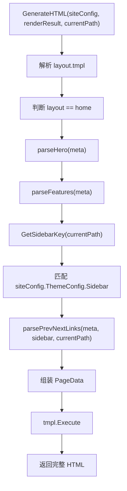

### 侧边栏匹配

`GetSidebarKey(s)` 取当前路径最后一个 `/` 之前的前缀：

- `/guide/index.html` -> `/guide/`
- `/history/prev-next-links.html` -> `/history/`
- `/index.html` -> `/`

`GenerateHTML` 先查找精确 sidebar key，如果没有，则回退到 `/`。

### 上下页链接推导

`parsePrevNextLinks` 的优先级：

1. 将当前匹配的 sidebar 递归扁平化，只保留有 `Link` 的项目。
2. 根据 `currentPath` 查找当前页位置，自动推导前一页、后一页。
3. 如果 frontmatter 中配置了 `prev` 或 `next`，则覆盖自动推导。
4. 如果 frontmatter 中配置 `prev: false` 或 `next: false`，则禁用对应链接。

### 模板组成

`layout.tmpl` 定义了这些模板块：

| 模板块 | 作用 |
| --- | --- |
| `VPNav` | 顶部导航、logo、暗色模式按钮、社交链接、移动端菜单按钮。 |
| `VPSidebarItemNode` | 递归渲染侧边栏节点。 |
| `VPSidebar` | 页面侧边栏容器。 |
| `VPContent` | 根据 `IsHome` 渲染首页或文档页。 |
| `VPHome` | 首页 hero、actions、features、正文内容。 |
| `VPDoc` | 文档正文和上一页/下一页 footer。 |
| `VPFooter` | 全站页脚。 |

## 8. 开发服务器

文件：

- `internal/server/server.go`
- `internal/server/livereload.go`

### HTTP 路由

```text
GET /ws
  -> LiveReload.ServeHTTP

GET /assets/{assetname}
  -> handleAsset
  -> theme.css / app.js

/
  -> handleRequest
  -> HTML 请求动态渲染 Markdown
  -> 其他请求尝试作为静态文件返回
```

### 请求处理流程

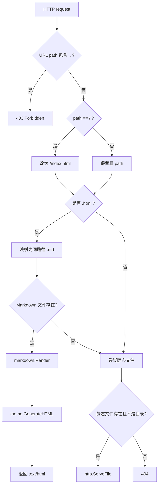

### Live reload 流程

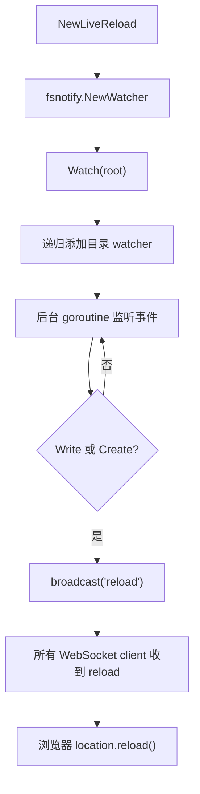

注意：`Watch` 当前只在启动时递归添加已有目录；运行时新建目录后，代码没有自动把新目录加入 watcher。

## 9. 静态构建

文件：`internal/build/build.go`

### Build 流程

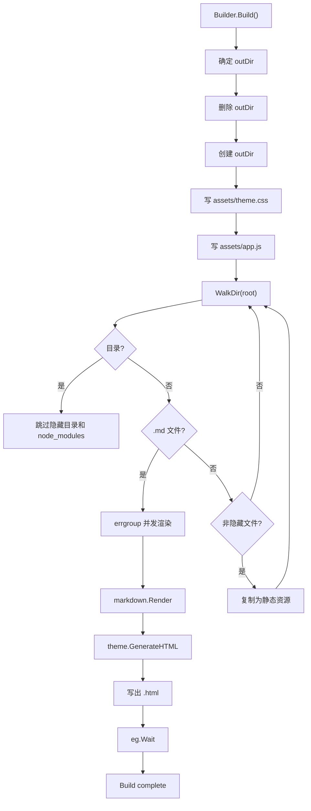

### 输出规则

| 输入 | 输出 |
| --- | --- |
| `index.md` | `index.html` |
| `guide/index.md` | `guide/index.html` |
| `README.md` | 当前目录的 `index.html` |
| `foo/bar.md` | `foo/bar.html` |
| 非隐藏静态文件 | 按相对路径复制到输出目录 |

### 并发模型

- Markdown 渲染使用 `errgroup.Group` 并发执行。
- `sem := make(chan struct{}, 64)` 限制最大并发数为 64。
- 静态资源复制是同步执行，以避免大目录下文件描述符压力。

## 10. 前端运行时

文件：`internal/theme/theme.js`

### 客户端能力

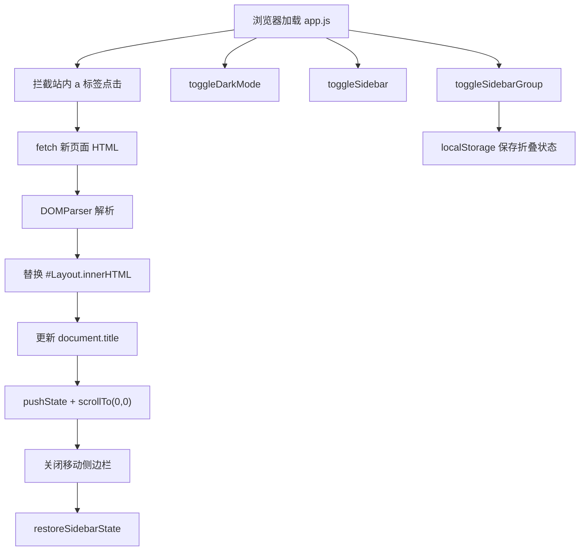

### localStorage key

| key | 用途 |
| --- | --- |
| `gopress-theme-appearance` | 保存 `dark` 或 `light` 主题偏好。 |
| `gopress-sidebar-states` | 保存各侧边栏分组的折叠状态。 |

### 开发模式追加脚本

`theme.GetThemeJS(true)` 会在内置 `theme.js` 后追加 WebSocket 客户端：

```js
const ws = new WebSocket('ws://' + location.host + '/ws');
ws.onmessage = (e) => {
  if (e.data === 'reload') location.reload();
};
```

生产构建中使用 `theme.GetThemeJS(false)`，不会包含 live reload 逻辑。

## 11. 内容与配置数据流

### 开发模式数据流

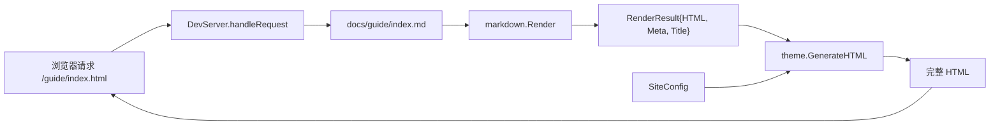

### 构建模式数据流

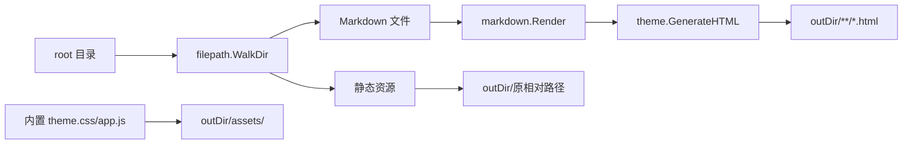

## 12. 示例文档站点

`docs/` 是一个可运行的示例站点：

| 路径 | 说明 |
| --- | --- |
| `docs/.gopress/config.json` | 示例站点配置。 |
| `docs/index.md` | 首页，使用 `layout: home`、`hero`、`features` frontmatter。 |
| `docs/guide/index.md` | Guide 页面。 |
| `docs/icetest/index.md` | 测试页面。 |
| `docs/history/*.md` | 功能历史与说明文档。 |
| `docs/changed-log/theme-refactoring.md` | 主题重构说明。 |
| `docs/.gopress/dist/` | 已生成的构建产物，不是源码核心路径。 |

示例首页 frontmatter 中的 `hero` 和 `features` 会被 `theme.parseHero`、`theme.parseFeatures` 转为首页区块。

## 13. Docker 运行链路

### Dockerfile

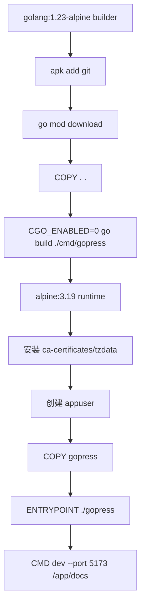

### docker-compose.yml

- 构建当前目录镜像。
- 暴露 `5173:5173`。
- 将本地 `./docs` 挂载到容器 `/app/docs`。
- 默认运行开发服务器。

## 14. 关键函数索引

| 函数/方法 | 文件 | 作用 |
| --- | --- | --- |
| `main` | `cmd/gopress/main.go` | 执行 root command。 |
| `init` | `cmd/gopress/main.go` | 注册 CLI flags 和子命令。 |
| `DefaultSiteConfig` | `internal/config/config.go` | 返回默认站点配置。 |
| `LoadConfig` | `internal/config/config.go` | 加载 JSON/YAML 配置。 |
| `SidebarItem.IsCollapsible` | `internal/config/config.go` | 判断侧边栏项是否可折叠。 |
| `SidebarItem.IsCollapsed` | `internal/config/config.go` | 判断侧边栏项默认是否折叠。 |
| `Render` | `internal/markdown/markdown.go` | 带 LRU 缓存的文件级 Markdown 渲染。 |
| `RenderBytes` | `internal/markdown/markdown.go` | 字节级 Markdown 渲染。 |
| `GenerateHTML` | `internal/theme/theme.go` | 组装页面数据并执行模板。 |
| `GetThemeCSS` | `internal/theme/theme.go` | 返回内置 CSS。 |
| `GetThemeJS` | `internal/theme/theme.go` | 返回内置 JS，可按 dev/prod 注入 live reload。 |
| `GetSidebarKey` | `internal/theme/theme.go` | 根据当前路径推导侧边栏配置 key。 |
| `parseHero` | `internal/theme/theme.go` | 从 frontmatter 解析首页 hero。 |
| `parseFeatures` | `internal/theme/theme.go` | 从 frontmatter 解析首页 features。 |
| `parsePrevNextLinks` | `internal/theme/theme.go` | 从侧边栏和 frontmatter 推导上下页链接。 |
| `flattenSidebar` | `internal/theme/theme.go` | 扁平化嵌套侧边栏。 |
| `DevServer.Start` | `internal/server/server.go` | 启动开发服务器。 |
| `DevServer.handleAsset` | `internal/server/server.go` | 返回内置主题资源。 |
| `DevServer.handleRequest` | `internal/server/server.go` | 处理页面请求、动态渲染 Markdown 或返回静态文件。 |
| `NewLiveReload` | `internal/server/livereload.go` | 初始化 fsnotify watcher。 |
| `LiveReload.Watch` | `internal/server/livereload.go` | 递归监听目录变化。 |
| `LiveReload.ServeHTTP` | `internal/server/livereload.go` | WebSocket 升级与连接管理。 |
| `LiveReload.broadcast` | `internal/server/livereload.go` | 向所有客户端广播 reload 消息。 |
| `Builder.Build` | `internal/build/build.go` | 生产构建入口。 |

## 15. 外部依赖角色

| 依赖 | 使用位置 | 作用 |
| --- | --- | --- |
| `github.com/icetech233/cobra` | `cmd/gopress` | CLI 命令与 flags。 |
| `github.com/yuin/goldmark` | `internal/markdown` | Markdown 渲染核心。 |
| `github.com/yuin/goldmark-meta` | `internal/markdown` | frontmatter 元数据。 |
| `github.com/yuin/goldmark-highlighting/v2` | `internal/markdown` | 代码高亮。 |
| `github.com/hashicorp/golang-lru/v2` | `internal/markdown` | Markdown 渲染结果缓存。 |
| `github.com/fsnotify/fsnotify` | `internal/server` | 文件变化监听。 |
| `github.com/gorilla/websocket` | `internal/server` | live reload WebSocket。 |
| `golang.org/x/sync/errgroup` | `internal/build` | 并发构建错误聚合。 |
| `gopkg.in/yaml.v3` | `internal/config` | YAML 配置解析。 |

## 16. 当前实现注意点

- `README.md`、`Dockerfile`、`docker-compose.yml`、部分源码注释和模板文案存在中文乱码，可能是文件编码或历史保存格式造成的。
- `server.handleRequest` 中配置热加载代码被注释掉，因此开发服务器启动后修改 `.gopress/config.json` 不会在下一次请求自动生效。
- `LiveReload.Watch` 只递归监听启动时已有目录，新建目录本身不会自动加入监听。
- `Build` 会跳过隐藏目录，但特殊允许进入 `.gopress`，随后又跳过 `.gopress` 下的文件；这可以避免把构建产物再次复制进输出目录。
- `markdown.Render` 的缓存 key 使用文件路径和修改时间；同一文件多次请求如果 modtime 不变会复用结果。
- 模板使用 `text/template`，正文 HTML 通过 `{{ .Content }}` 输出。因为 `Content` 是 string，默认会被 HTML 转义；如果希望 Markdown HTML 原样输出，通常需要改用 `html/template` 的 `template.HTML` 或调整模板执行方式。当前生成产物需要实际检查是否符合预期。

## 17. 一句话心智模型

GoPress 的核心是一个很直接的流水线：

```text
配置 + Markdown 文件
  -> goldmark 渲染为 HTML 片段和 frontmatter
  -> theme 根据配置、frontmatter、侧边栏生成整页 HTML
  -> dev 模式即时返回，build 模式写入 dist
```
